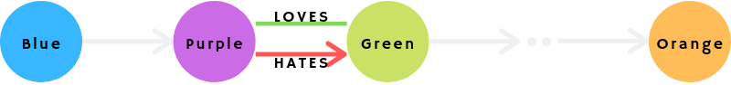

# Complex Example



We'll be searching by this rules:
 - first node has a label "Blue"
 - first node is connected to the second one with an edge of any type
 - second node has a label "Purple"
 - second node has a connection of any direction of type "LOVES" to the third
      one
 - second node is connected to the third one with an edge of type "Green"
 - the last node has a label "Orange"
 - the third node is connected to the last one with an arbitrary number of edges
     (in this case up to 5) of any type through nodes with a label Blue XOR
     Purple

This query will result in creating of the following entities:
1) Node "Blue"
1) Node "Purple"
1) Node "Green"
1) Node "Orange"
1) Edge "Edge" connecting 1 and 2
1) Edge "Loves" connecting 2 and 3
1) Edge "Hates" connecting 2 and 3
1) Edges and nodes of appropriate types found between the nodes 3 and 4

The result of the query will be flattened iterables of entities:
1, 5, 2, 6, 3, 7, 6, 3, *8, 4

```python
class Blue(Node): pass
class Purple(Node): pass
class Green(Node): pass
class Orange(Node): pass
class Loves(Edge): pass
class Hates(Edge): pass

results = (MyDB
    .match(Blue)
    .connected_through(Edge)
    .to(Purple, 'a')
    .connected_through(Loves, 'a_loves_b')
    .with_(Green, 'b')
    .connected_through(Hates)
    .by('a')
    .connected_through('a_loves_b')
    .with_('b')
    .connected_through(Edge, max_hops=5, node_types=Blue ^ Purple)
    .to(Orange)
)
```

```cypher
MATCH
  h = (c:Blue)-[d]->(a:Purple),
  i = (a)-[a_loves_b:LOVES]-(b:Green),
  j = (b)<-[e:HATES]-(a),
  k = (b)-[*..5]->(g:Orange)
WITH *, relationships(k) as f_edges, nodes(k) as f_nodes
WHERE all(m IN f_nodes[1..-1] WHERE "Blue" in labels(m) XOR "Purple" in labels(m))
RETURN *
```

```cypher
CREATE
  (:Blue)-[:RANDOM]->(a:Purple)<-[:LOVES { uid: 123 }]-(b:Green),
  (a)-[:HATES { uid: 123 }]->(b),
  (b)-[:RANDOM]->(:Orange),
  (b)-[:RANDOM]->(:Blue)-[:RANDOM]->(:Orange),  // Should match
  (b)-[:RANDOM]->(:Blue)-[:RANDOM]->(:Purple)-[:RANDOM]->(:Orange),  // Should match
  (b)-[:RANDOM]->(:Blue:Purple)-[:RANDOM]->(:Orange),  // Shouldn't match
  (b)-[:RANDOM]->(:White)-[:RANDOM]->(:Orange)  // Shouldn't match
```
